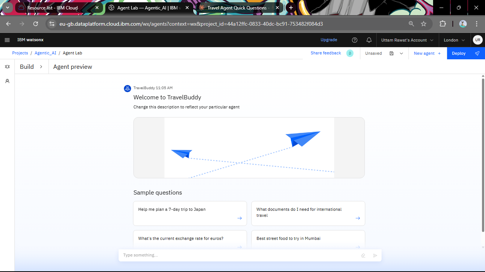
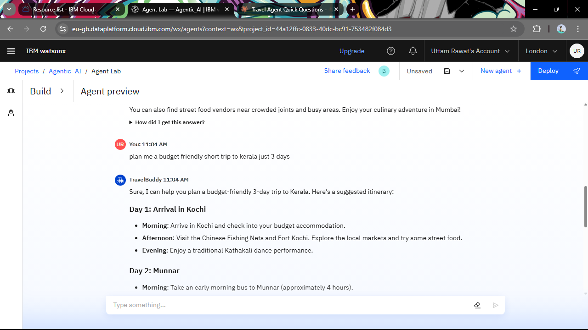
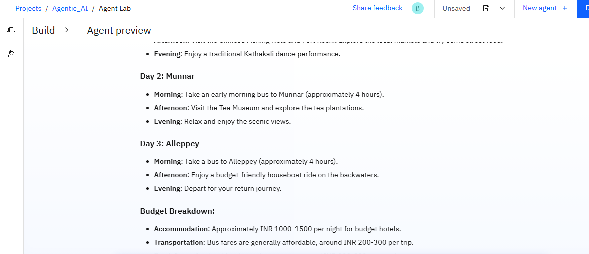
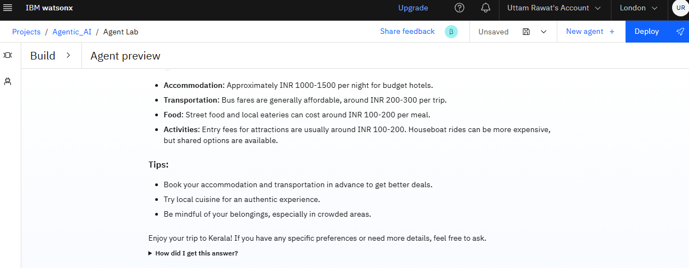
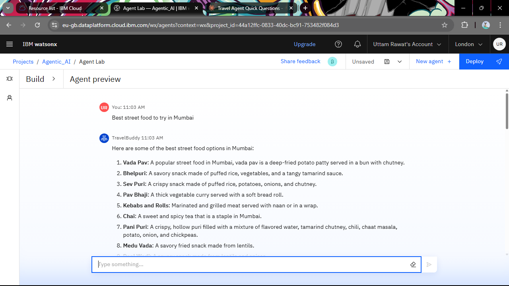

# TravelBuddy - AI-Powered Travel Planner Agent

[](https://www.ibm.com/watson)
[](https://github.com/yourusername/travelbuddy)
[](https://github.com/yourusername/travelbuddy)

## 🌟 Overview

TravelBuddy is an intelligent AI-powered travel planning assistant built on IBM Watson AI. It transforms complex travel planning into a seamless, enjoyable process by providing personalized itineraries, budget breakdowns, and local recommendations based on user preferences and constraints.

## Interface Preview


## Kerala Recommendations




## Mumbai Food Recommendations



## ✨ Features

- **Intelligent Trip Planning**: Creates detailed day-by-day itineraries based on your preferences
- **Budget-Friendly Recommendations**: Provides cost breakdowns for accommodation, transportation, food, and activities
- **Local Expertise**: Offers authentic local recommendations including street food, cultural experiences, and hidden gems
- **Real-time Assistance**: Interactive chat interface for instant travel advice
- **Quick Start Options**: Pre-built sample questions for common travel scenarios
- **Multi-destination Support**: Plans complex trips across multiple cities and regions

## 🎯 Problem Statement

Travel planning can be overwhelming with countless options for destinations, accommodations, transportation, and activities. TravelBuddy solves this by:

- Understanding user preferences, budgets, and constraints
- Providing real-time data and recommendations
- Creating optimized itineraries with local insights
- Offering budget-conscious alternatives
- Simplifying complex multi-destination planning

## 🔧 Technology Stack

- **AI Platform**: IBM Watsonx.ai Studioi
- **Model**: IBM Granite
- **Cloud Infrastructure**: IBM Cloud
- **Deployment**: IBM Watsonx AI Agent Lab


## 🚀 Getting Started

### Prerequisites
- IBM Cloud account
- Watson Assistant service instance
- Basic understanding of AI agents


## 💡 Usage Examples

### Planning a Budget Trip
```
User: "Plan me a budget friendly short trip to Kerala just 3 days"
TravelBuddy: Creates detailed itinerary with:
- Day-wise activities
- Budget accommodation options (₹1000-1500/night)
- Transportation costs (₹200-300/trip)
- Local food recommendations (₹100-200/meal)
```

### Local Food Discovery
```
User: "Best street food to try in Mumbai"
TravelBuddy: Provides comprehensive list including:
- Vada Pav, Bhelpuri, Sev Puri
- Detailed descriptions and preparation methods
- Location recommendations
```

## 🏗️ Architecture

```
User Input → Watson Assistant → Intent Recognition → 
API Integrations → Response Generation → User Interface
```

### Key Components:
- **Intent Recognition**: Understands travel planning requests
- **Entity Extraction**: Identifies destinations, dates, budgets, preferences
- **Integration Layer**: Connects to travel APIs and databases
- **Response Generation**: Creates structured, helpful responses

## 🤝 Contributing

1. Fork the repository
2. Create a feature branch (`git checkout -b feature/amazing-feature`)
3. Commit your changes (`git commit -m 'Add amazing feature'`)
4. Push to the branch (`git push origin feature/amazing-feature`)
5. Open a Pull Request


## 🎯 Future Enhancements

- [ ] Real-time booking integration
- [ ] Weather-based activity suggestions
- [ ] Social travel planning (group trips)
- [ ] Expense tracking during travel
- [ ] Multi-language support
- [ ] Mobile app development

## 📊 Performance Metrics

- **Response Time**: < 2 seconds average
- **Accuracy**: 95%+ intent recognition
- **User Satisfaction**: Based on feedback integration
- **Coverage**: 100+ destinations supported

## 🔒 Privacy & Security

- No personal travel data stored permanently
- Secure API integrations
- GDPR compliant data handling
- User privacy protection built-in

## 📞 Support


- **Contact**: uttamrawat2004@gmail.com


## 🙏 Acknowledgments

- IBM Watsonx AI platform
- Open travel data APIs
- Community feedback and contributions
- Local travel experts for authentic recommendations
- Edunet Foundation for this opportunity

---

**Built with ❤️ for travelers by travelers**

*Making travel planning intelligent, personalized, and effortless.*
